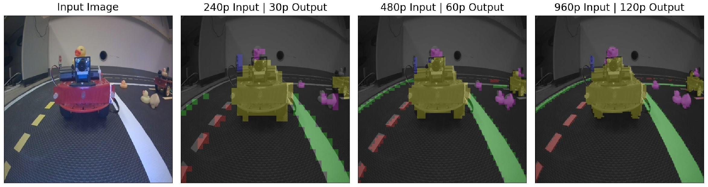

Monocular Robot Navigation with Self-Supervised Pretrained Vision Transformers
==============================


Model code for [Monocular Robot Navigation with Self-Supervised Pretrained Vision Transformers](https://sachamorin.github.io/dino/).

This is the segmentation and Vision Transformer code. For the Duckietown agent, have a look at [this repository](https://github.com/MikeS96/object-detection/tree/daffy).

Data and trained checkpoints can be found [here]().


## Install
You can install this repo directly with pip : 
```
pip install --upgrade git+https://github.com/sachaMorin/dino.git
``` 

## Prediction
We provide two trained checkpoints in ```models```. You can run inference like so:
```python
import os

import torch
from PIL import Image

from dt_segmentation import DINOSeg

model_path = os.path.join("models", "3_block_finetuned.ckpt")
frame_path = os.path.join("docs", "img", "frame.jpg")

mlp_dino = DINOSeg.load_from_checkpoint(model_path).to('cuda:0' if torch.cuda.is_available() else 'cpu')

# Set the inference resolution
# Lower resolution is faster and more memory efficient, but coarser
# Try 240 or 480. 960 if you have a lot of memory.
mlp_dino.set_resolution(480)

# Get frame
with open(frame_path, 'rb') as file:
    img = Image.open(file)
    x = img.convert('RGB')

# Get predictions
# Predictions will always be an ndarray of shape 480x480 
# regardless of the inference resolution
pred = mlp_dino.predict(x)
```
Additionally, to visualize the prediction:
```python3
import matplotlib.pyplot as plt
import numpy as np
import imgviz

# Visualize segmentation
viz = imgviz.label2rgb(
    pred,
    imgviz.rgb2gray(np.array(x.resize((480, 480)))),
    alpha=.65
)
plt.imshow(viz)
plt.show()
```

## Training
After downloading the [data](), you can use ```dt_segmentation/run_experiment.py``` to train new models:
```bash
python3 run_experiment.py --data_path data --write_path results --n_blocks 1 --batch_size 1 --epochs 5 --augmentations --finetune
```
